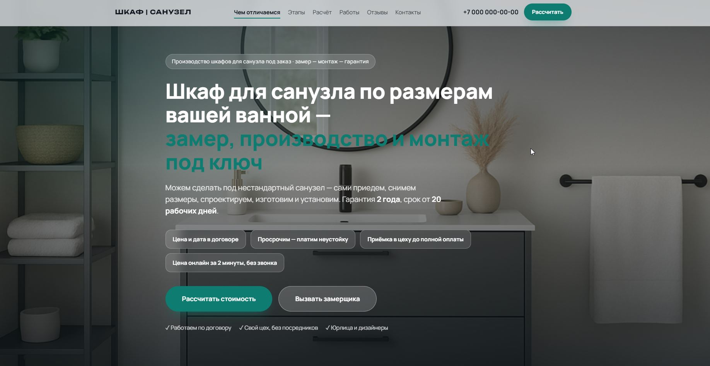
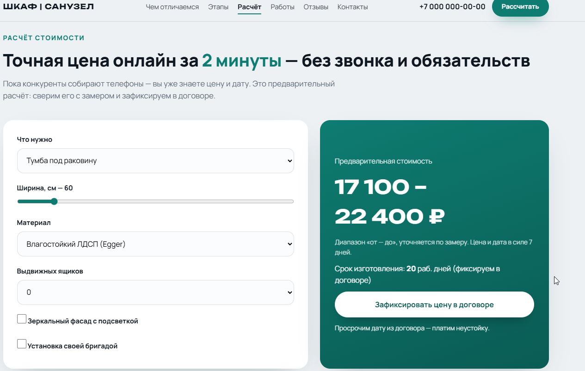

# Шкаф для санузла — лендинг производителя мебели на заказ

Одностраничный сайт-лендинг для компании, специализирующейся на производстве и установке шкафов для санузла по индивидуальным размерам. Проект включает готовый HTML/CSS/JS-лендинг и калькулятор .


---

## Название проекта

**Шкаф | Санузел** — лендинг производителя шкафов для санузла на заказ

---

## Решаемая задача

Рынок мебели для ванной/санузла в России (~91 000 объявлений на Авито по запросу «шкаф в ванную») страдает от системных проблем, которые не закрывает ни один из 5 проанализированных конкурентов:

1. **Сроки без гарантий.** Все конкуренты дают вилки «от 14 до 30 дней» или «до 65 дней», но ни один не фиксирует конкретную дату деньгами (неустойка за просрочку).
2. **Цена скрыта.** Калькуляторы у конкурентов — квизы со сбором телефона и перезвоном менеджера. Мгновенной честной цены онлайн без звонка нет ни у кого.
3. **Оплата без доверия.** Только 1 из 5 конкурентов (Палитра Мебели) даёт приёмку в цеху до полной оплаты. Остальные требуют 100% оплаты до получения изделия.
4. **Нет прайса.** Ни один конкурент не публикует цены «от» на типовые конфигурации — рынок полностью непрозрачен по цене.

### Что делает этот лендинг

Лендинг решает каждую из этих проблем через уникальное УТП:

> **Цена и дата в договоре. Просрочим — платим неустойку. Мебель вы принимаете в цеху до полной оплаты. Узнайте точную цену онлайн за 2 минуты — без звонка и без обязательств.**

- **Онлайн-калькулятор** с мгновенным расчётом стоимости и срока (не квиз — реальная цена на выходе)
- **Публичный прайс** «от … ₽» на типовые пакеты (тумба 60 см, пенал, комплекс, зеркальный шкаф)
- **Неустойка за просрочку** — срок фиксируется календарной датой в договоре
- **Приёмка до оплаты** — схема 30/70: 30% запускают производство, 70% платите после осмотра изделия

---

## Целевая аудитория

### Сегмент 1. Частные лица (B2C)

- **Кто:** Женщины 28–50, пары. Жильё от хрущёвки (санузел 2–3,5 м²) до новостроек с нишами.
- **Боль:** Стандартная мебель не встаёт в размер («щели, зазоры, коряво»). Страх разбухания от пара («как ведёт себя тумба в ванной?»). Страх хлипкого крепления («шкаф тянется за дверцей»).
- **Мотив:** Спрятать «мыльно-рыльные принадлежности», вписать в нестандартный размер, получить влагостойкий продукт.
- **Фраза:** *«Наконец-то я всё спрятала!»*

### Сегмент 2. Дизайнеры интерьера

- **Кто:** Студии, частные дизайнеры, архитекторы. Работают по проекту ванной с конкретными размерами и цветами.
- **Боль:** Фабрики отказываются от нестандартного конструктива. Боится «увода клиента» производителем. Срыв сроков = удар по репутации.
- **Мотив:** Реализовать эскиз в точном цвете (RAL/NCS) и размере. Один подрядчик «от эскиза до монтажа».
- **Фраза:** *«Вы точно не свяжетесь с моим клиентом?»*

### Сегмент 3. Ремонтные бригады и застройщики

- **Кто:** Бригадиры, прорабы, небольшие строительные компании. Сдают объекты в срок.
- **Боль:** Мебель на заказ удлиняет сдачу. Переделки и «халтура» фабрики. Скрытые доплаты.
- **Мотив:** Предсказуемая смета, работа по безналу, собственный монтаж, фиксированный срок.
- **Фраза:** *«На объект горит. Какой реальный срок?»*

---

## Структура проекта

```
├── index.html          — главная HTML-страница лендинга
├── style.css           — стили (glassmorphism, адаптивность, анимации)
├── script.js           — логика: калькулятор, форма заявки, параллакс, scrollspy
├── audience.md         — аудит аудитории: 3 сегмента с дословными фразами из интернета
├── competitors.md      — анализ 5 конкурентов (Дизайн-Ванной, shkafy-v-vannuyu, Корпусторг, Палитра, Elit Aqua)
├── utp.md              — разработка УТП и формулировки для первого экрана
├── insights.md         — 5 главных выводов по аудитории и рынку
├── plan.md             — план привлечения клиентов (6 каналов)
├── ТЗ/                 — техническое задание на разработку сайта
├── разные картинки/    — изображения работ (предметная съёмка)
├── скриншоты готового сайта и таблицы с тестовой заявкой/
├── Скриншот таблицы/
├── промпт для текста .docx
├── промт ЛЕНДИНГ для Open Code.docx
├── Калькулятор_параметры.xlsx
└── webbridge_req.json
```

---

## Функциональность лендинга

### Разделы страницы

| Раздел | Описание |
|---|---|
| **Шапка** | Навигация с scrollspy, телефон, кнопка CTA, бургер-меню для мобильных |
| **Первый экран (Hero)** | УТП, обещания (цена/дата/неустойка/приёмка), два CTA, бейджи доверия |
| **Чем отличаемся** | 4 карточки-дифференциатора со ссылкой на боли конкурентов + статистика |
| **Этапы работы** | 5 шагов: замер → проект → производство → монтаж → приёмка |
| **Расчёт стоимости** | Онлайн-калькулятор + публичный прайс «от … ₽» |
| **Наши работы** | Галерея из 16 проектов (предметная съёмка, не сток) |
| **Отзывы** | Реальные фразы покупателей с форумов (Mastergrad, Babyblog, Otzovik) по 3 сегментам |
| **Заявка** | Форма с валидацией, выбор канала связи, honeypot от ботов |

### Технические особенности

- **Адаптивность** — полностью отзывчивый дизайн (мобильные, планшеты, десктоп)
- **Glassmorphism** — стеклянные карточки с backdrop-filter и полупрозрачными градиентами
- **Параллакс** — эффект прокрутки на фоне Hero
- **Scrollspy** — активный пункт меню при прокрутке
- **IntersectionObserver** — появление блоков при скролле (reveal-анимации)
- **Калькулятор** — мгновенный расчёт цены и срока по параметрам (тип, ширина, материал, ящики, подсветка, монтаж)
- **Маска телефона** — лёгкая валидация ввода
- **Honeypot** — защита формы от спам-ботов
- **LocalStorage** — заявки сохраняются локально (для продакшена — подключить серверный API)

### Калькулятор: параметры расчёта

| Параметр | Варианты |
|---|---|
| Тип изделия | Тумба под раковину, Шкаф-пенал, Шкаф под стиральную машину, Комплекс |
| Ширина | 40–200 см (шаг 5 см) |
| Материал | Влагостойкий ЛДСП (Egger), МДФ влагостойкий, Эмаль/пластик |
| Выдвижные ящики | 0–3 шт. |
| Зеркальный фасад с подсветкой | Да/Нет |
| Установка | Да/Нет |

---

## Маркетинговая аналитика

### УТП (Уникальное Торговое Предложение)

Сформировано на основе анализа 5 конкурентов и 3 сегментов аудитории:

> **«Шкаф для санузла по размерам вашей ванной — замер, производство и монтаж под ключ»**

Ключевые дифференциаторы (уникальны для рынка):
- Финансовая неустойка за просрочку срока
- Мгновенная цена онлайн без звонка менеджеру
- Приёмка изделия в цеху до доплаты 70%
- Публичный прайс «от … ₽»

### Конкурентный анализ (5 компаний)

| Компания | Срок | Гарантия | Калькулятор | Неустойка | Приёмка до оплаты |
|---|---|---|---|---|---|
| Дизайн-Ванной.РФ | 14–30 дн. | 12 мес. | Квиз (сбор телефона) | Нет | Нет |
| shkafy-v-vannuyu | Не называет | 1 год | Квиз | Нет | Нет |
| Корпусторг | До 65 дн. | 2 года | Нет | Нет | Нет |
| Палитра Мебели | 20 дн. | 1+3 года | Ручной за 1 дн. | Нет | **Да** |
| Elit Aqua | До 14 дн. | 2 года | Нет | Нет | Нет |

### Каналы привлечения (по приоритету)

1. Яндекс.Директ на горячие запросы («шкаф для ванной на заказ», «пенал в санузел + город»)
2. SEO по коммерческим кластерам + микроразметка Product
3. Карточки на Яндекс.Маркете, Авито, Wildberries
4. Партнёрская программа для дизайнеров и ремонтных бригад (5–10%)
5. Геореклама: Яндекс.Карты, 2ГИС + видеоотзывы «до/после»
6. Сквозная аналитика: Яндекс.Метрика (цели, Вебвизор)

---

## Быстрый старт

1. Откройте `index.html` в браузере
2. Впишите реальные данные компании: название, телефон, email, ИНН/ОГРН
3. Замените плейсхолдеры цен в `script.js` (блок `BASE`) на актуальный прайс
4. Замените изображения в разделе «Наши работы» на фотографии ваших проектов
5. Подключите серверный API для приёма заявок (в `script.js` закомментирован `fetch('/api/lead')`)
6. Настройте Яндекс.Метрику (ID: в `competitors.md` найдёте примеры конкурентов)

---

## Технологии

- **HTML5** — семантическая разметка
- **CSS3** — Flexbox/Grid, glassmorphism (backdrop-filter), CSS custom properties, анимации
- **Vanilla JavaScript** (ES5 совместимый) — без фреймворков и зависимостей
- **Google Fonts** — Manrope + Unbounded

---

## Лицензия

Проект создан для образовательных и коммерческих целей. Все маркетинговые данные (аудитория, конкуренты, инсайты) собраны из открытых источников.
